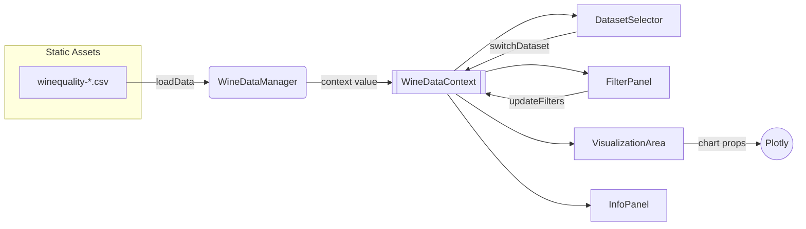

# Developer Documentation

This guide complements the root README by pointing engineers to the most important technical references for Wine Explorer. It highlights how the client-only architecture is assembled, how core components collaborate, and which commands keep the project healthy.

## Architecture Overview

- **Client-only data flow:** CSV files in `public/data` are loaded through `wineDataManager`, normalised, cached, and exposed to the UI through `WineDataContext`.
- **State orchestration:** `WineDataContext` owns dataset selection, filter state, load status, and error handling; consumers subscribe through React context hooks.
- **Rendering pipeline:** UI components (dataset selector → filter panel → visualization area → info panel) react to context updates and re-render in isolation.
- **Performance envelope:** Dataset loads retry up to three times with exponential backoff and leverage in-memory caching to avoid redundant network fetches.



Additional deep-dives live in `docs/architecture/`, starting with [`architecture.md`](architecture.md) and the [architecture index](architecture/index.md).

## Component Guide

| Component           | Key props/callbacks | Responsibilities                                                                           | Usage example                                      |
| ------------------- | ------------------- | ------------------------------------------------------------------------------------------ | -------------------------------------------------- |
| `DatasetSelector`   | `className?`        | Toggle between red/white datasets, announce status updates, expose retry affordance        | ` <DatasetSelector className="sidebar-section" />` |
| `FilterPanel`       | `className?`        | Adjust filter ranges, sync URL query params, dispatch `updateFilters` and `clearFilters`   | `<FilterPanel className="sidebar-section" />`      |
| `VisualizationArea` | `className?`        | Render histogram/scatter plots, expose feature dropdowns, stream filtered data into Plotly | `<VisualizationArea className="content" />`        |
| `InfoPanel`         | `className?`        | Present dataset metadata, filtered counts, and citation information                        | `<InfoPanel className="content" />`                |

Example composition in a page layout:

```tsx
import { DatasetSelector } from '../components/DatasetSelector';
import { FilterPanel } from '../components/FilterPanel';
import { VisualizationArea } from '../components/visualizations/VisualizationArea';
import { InfoPanel } from '../components/InfoPanel';

export const ExploreDataPage = () => (
  <main className="explore-data">
    <aside>
      <DatasetSelector />
      <FilterPanel />
    </aside>
    <section>
      <VisualizationArea />
      <InfoPanel />
    </section>
  </main>
);
```

Extended component behaviours, props, and event descriptions are maintained in [`docs/architecture/components.md`](architecture/components.md).

## Development Workflow

1. **Install dependencies:** `npm install`
2. **Run the app:** `npm run dev` (opens on http://localhost:5173 by default, configurable via VITE_PORT environment variable)
3. **Edit and preview:** Changes hot-reload through Vite; dataset switches stream status messages to assistive tech.
4. **Validate:**
   - Static analysis: `npm run lint`, `npm run prettier`
   - Unit tests: `npm test -- --watch`
   - E2E tests: `npm run cy:test`
5. **Commit:** Run `npm run style:all` before pushing; Husky will re-run linting on staged files.

Development workflow policies, branching recommendations, and environment configuration details are captured in [`docs/architecture/development-workflow.md`](architecture/development-workflow.md).

## Testing Strategy

- **Unit & integration:** Vitest exercises data utilities and React components in isolation (see `tests/` for setup and helpers).
- **End-to-end:** Cypress scripts in `cypress/e2e` cover dataset switching, filtering, and accessibility smoke tests.
- **Accessibility:** The live announcement system is unit-tested through custom hooks; manual verification steps are listed in `docs/qa/`.

Testing scope, sample test snippets, and coverage goals are documented in [`docs/architecture/testing-strategy.md`](architecture/testing-strategy.md).

## Deployment Cheat Sheet

1. Set `VITE_BASE_URL` (if deploying behind a path) or ensure `package.json#homepage` is correct.
2. `npm run build` to create the production bundle in `dist/`.
3. `npm run preview` for a pre-flight check.
4. `npm run deploy` to publish to GitHub Pages using the `gh-pages` CLI helper, or upload the `dist/` directory to your static host of choice.

Detailed architecture and operational considerations, including CDN expectations and analytics hooks, live in [`docs/architecture/deployment-architecture.md`](architecture/deployment-architecture.md).

## API Reference Map

- [`docs/architecture/api-specification.md`](architecture/api-specification.md) — client-side module APIs (`wineDataManager`, context surface area, error formats)
- [`docs/architecture/data-models.md`](architecture/data-models.md) — TypeScript interfaces for wine data and dataset metadata
- [`docs/architecture/error-handling-strategy.md`](architecture/error-handling-strategy.md) — standard error envelopes and recovery playbooks

## Contribution and Governance

Contribution workflows, coding standards, and review expectations are centralised in:

- `CONTRIBUTING.md`
- [`docs/architecture/coding-standards.md`](architecture/coding-standards.md)
- `CODE_OF_CONDUCT.md`

Refer to these documents before opening pull requests or introducing new dependencies.
