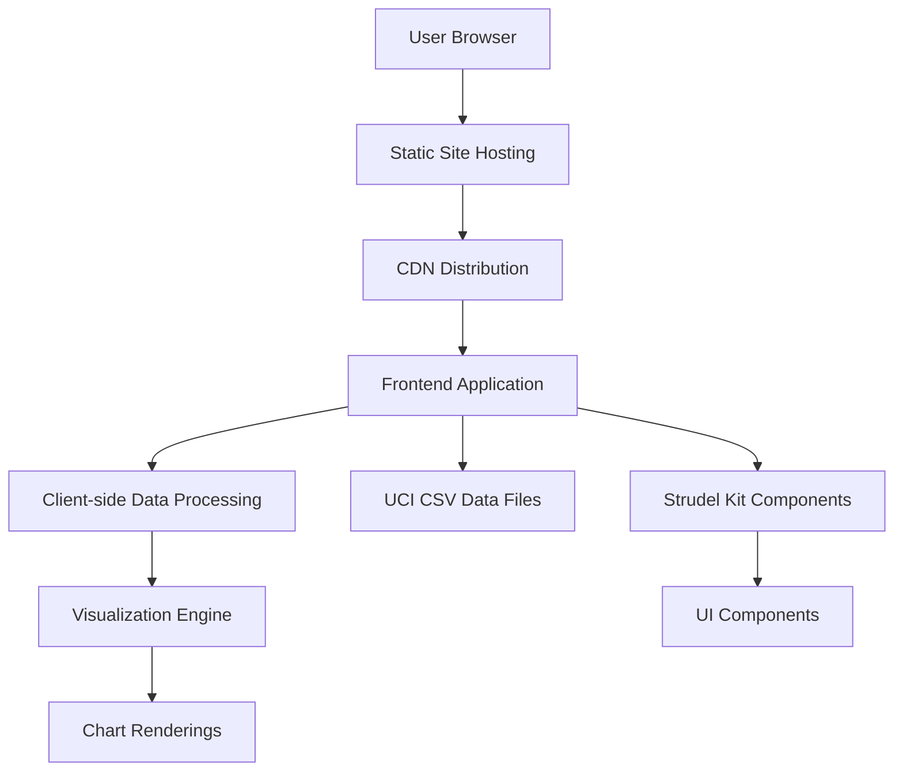
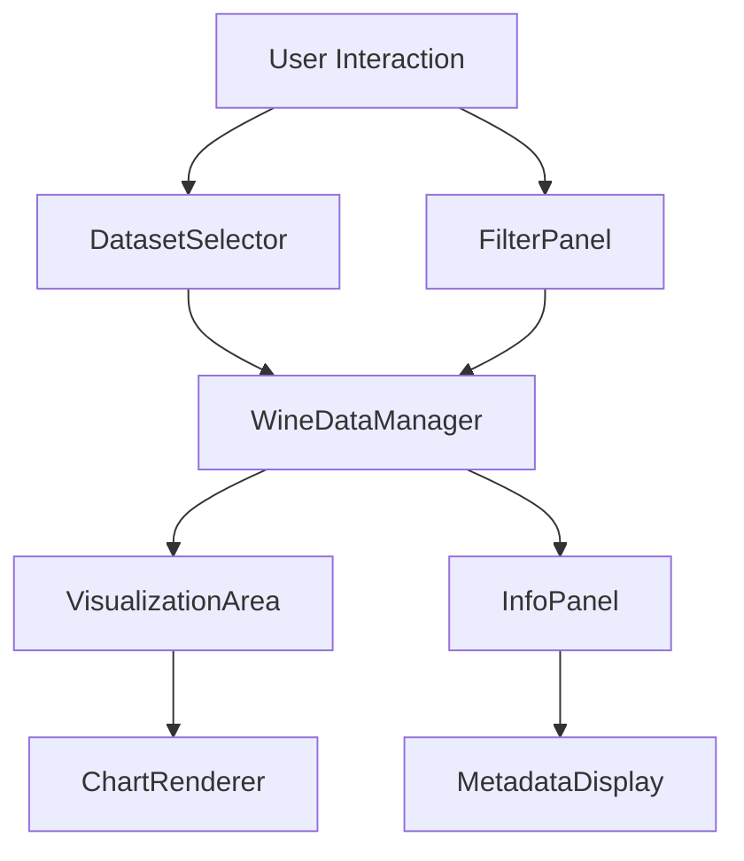
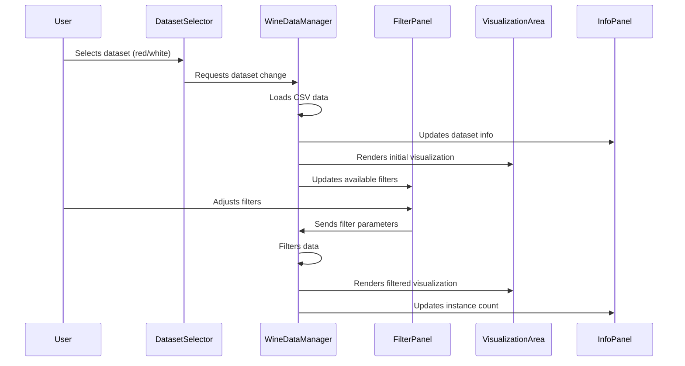
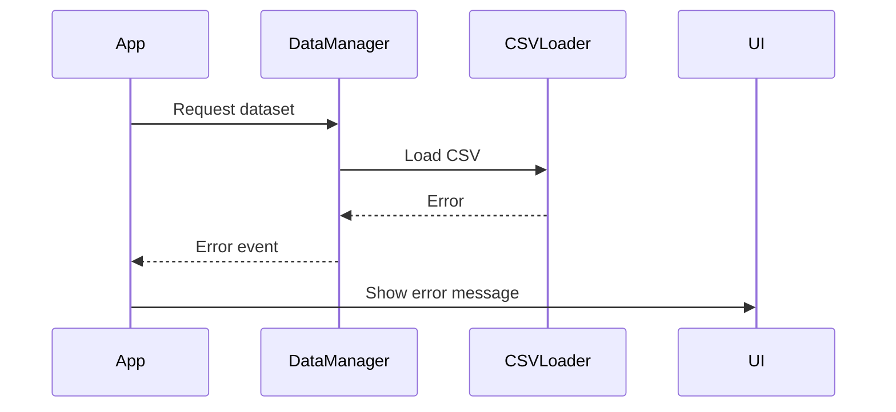

# Wine Explorer Fullstack Architecture Document

## Introduction

This document outlines the complete fullstack architecture for Wine Explorer, including backend systems, frontend implementation, and their integration. It serves as the single source of truth for AI-driven development, ensuring consistency across the entire technology stack.

This unified approach combines what would traditionally be separate backend and frontend architecture documents, streamlining the development process for modern fullstack applications where these concerns are increasingly intertwined.

### Starter Template or Existing Project

N/A - Greenfield project

### Change Log

| Date       | Version | Description                            | Author              |
| ---------- | ------- | -------------------------------------- | ------------------- |
| 2025-09-08 | 1.0     | Initial architecture document creation | Winston (Architect) |

## High Level Architecture

### Technical Summary

The Wine Explorer is a client-side only application designed to demonstrate the Strudel kit's capabilities for scientific data exploration. The architecture follows a modern Jamstack approach with static site generation and client-side data processing. The frontend is built with vanilla JavaScript, HTML, and CSS, leveraging Strudel kit components for UI elements and data visualization. Data is loaded directly from UCI JOSN files and processed client-side. The application is designed to be responsive and accessible, with a focus on performance optimization for datasets under 10MB. This architecture achieves the PRD goals by providing a simple, fast, and demonstrable prototype within a one-month timeline.

### Platform and Infrastructure Choice

**Platform:** Static Site Hosting (GitHub Pages)
**Key Services:** Static file hosting, CDN delivery
**Deployment Host and Regions:** Global CDN with edge locations

Rationale: For a client-side only prototype focused on demonstrating Strudel kit capabilities, a static site hosting platform is the most appropriate choice. It offers:

- Fast, reliable global delivery through CDN
- No backend infrastructure costs
- Simple deployment process
- Excellent performance for static assets
- No server-side complexity needed for this prototype

### Repository Structure

**Structure:** Monorepo with frontend-only application
**Monorepo Tool:** NPM Workspaces (built-in with Node.js)
**Package Organization:**

- `/src` - Main application source code
- `/public` - Static assets (CSV files, images)
- `/docs` - Documentation files
- `/tests` - Test files

### High Level Architecture Diagram



### Architectural Patterns

- **Jamstack Architecture:** Static site with client-side data processing - _Rationale:_ Optimal performance and simplicity for a prototype with no backend requirements
- **Component-Based UI:** Reusable UI components following Strudel kit patterns - _Rationale:_ Maintainability and consistency with Strudel kit demonstration goals
- **Client-Side Data Processing:** Process CSV data in browser - _Rationale:_ Aligns with PRD requirement for client-side implementation and eliminates backend complexity
- **Single Page Application:** All functionality within one HTML page - _Rationale:_ Simplifies development and deployment for prototype scope

## Tech Stack

### Technology Stack Table

| Category             | Technology                   | Version | Purpose                          | Rationale                                                       |
| -------------------- | ---------------------------- | ------- | -------------------------------- | --------------------------------------------------------------- |
| Frontend Language    | JavaScript (ES6+)            | ES2020+ | Core application logic           | Universally supported in modern browsers, no compilation needed |
| Frontend Framework   | Vanilla JS + Strudel Kit     | Latest  | UI components and utilities      | Demonstrates Strudel kit capabilities as required by PRD        |
| UI Component Library | Strudel Kit Components       | Latest  | Pre-built UI components          | Directly showcases Strudel kit as per project goals             |
| State Management     | Vanilla JS with Custom Store | ES2020+ | Application state handling       | Lightweight solution appropriate for prototype scope            |
| Backend Language     | N/A                          | N/A     | N/A                              | Client-side only implementation per PRD                         |
| Backend Framework    | N/A                          | N/A     | N/A                              | Client-side only implementation per PRD                         |
| API Style            | Client-side Data Fetching    | ES2020+ | Data retrieval                   | Direct CSV file loading as per requirements                     |
| Database             | CSV Files                    | N/A     | Data storage                     | Uses provided UCI dataset files directly                        |
| Cache                | Browser Cache                | Native  | Asset caching                    | Built-in browser capabilities sufficient for prototype          |
| File Storage         | Static File Hosting          | N/A     | CSV file hosting                 | Simplest approach for prototype with no user uploads            |
| Authentication       | N/A                          | N/A     | N/A                              | No authentication required per PRD                              |
| Frontend Testing     | Jest + Testing Library       | Latest  | Unit and integration tests       | Industry standard tools with good documentation                 |
| Backend Testing      | N/A                          | N/A     | N/A                              | No backend components to test                                   |
| E2E Testing          | Cypress                      | Latest  | End-to-end testing               | Comprehensive testing tool that works well with SPAs            |
| Build Tool           | Vite                         | Latest  | Development server and build     | Fast, modern build tool with excellent developer experience     |
| Bundler              | Vite (ESBuild/Rollup)        | Latest  | Code bundling                    | Built into Vite, optimized for modern web development           |
| IaC Tool             | N/A                          | N/A     | N/A                              | No infrastructure to provision for static site                  |
| CI/CD                | GitHub Actions               | Latest  | Automated testing and deployment | Integrated with GitHub, free for open source projects           |
| Monitoring           | Google Analytics             | Latest  | Basic usage tracking             | Simple implementation for prototype metrics                     |
| Logging              | Console Logging              | Native  | Debug logging                    | Built-in browser capabilities sufficient for prototype          |
| CSS Framework        | Strudel Kit CSS + Custom CSS | Latest  | Styling                          | Leverages Strudel kit styling while allowing customization      |

## Data Models

### WineDataPoint

**Purpose:** Represents a single wine sample with its physicochemical properties and quality rating

**Key Attributes:**

- fixedAcidity: number - Fixed acidity content
- volatileAcidity: number - Volatile acidity content
- citricAcid: number - Citric acid content
- residualSugar: number - Residual sugar content
- chlorides: number - Chloride content
- freeSulfurDioxide: number - Free sulfur dioxide content
- totalSulfurDioxide: number - Total sulfur dioxide content
- density: number - Density of the wine
- pH: number - pH level
- sulphates: number - Sulphate content
- alcohol: number - Alcohol content percentage
- quality: number - Quality rating (ordinal scale)

#### TypeScript Interface

```typescript
interface WineDataPoint {
  fixedAcidity: number;
  volatileAcidity: number;
  citricAcid: number;
  residualSugar: number;
  chlorides: number;
  freeSulfurDioxide: number;
  totalSulfurDioxide: number;
  density: number;
  pH: number;
  sulphates: number;
  alcohol: number;
  quality: number;
}
```

#### Relationships

- None (flat data structure from CSV)

### DatasetInfo

**Purpose:** Metadata about the wine dataset

**Key Attributes:**

- type: 'red' | 'white' - Type of wine
- source: string - Source of the dataset
- doi: string - Digital Object Identifier
- totalInstances: number - Total number of samples
- features: string[] - List of feature names

#### TypeScript Interface

```typescript
interface DatasetInfo {
  type: 'red' | 'white';
  source: string;
  doi: string;
  totalInstances: number;
  features: string[];
}
```

#### Relationships

- None

## API Specification

Since this is a client-side only application with no backend API, this section is not applicable.

## Components

### DatasetSelector

**Responsibility:** Allows users to switch between red and white wine datasets

**Key Interfaces:**

- onDatasetChange(dataset: 'red' | 'white'): void

**Dependencies:** None

**Technology Stack:** Strudel Kit Toggle Component, Vanilla JS Event Handling

### FilterPanel

**Responsibility:** Provides range sliders for filtering physicochemical features

**Key Interfaces:**

- onFilterChange(filters: WineFilter[]): void
- onClearFilters(): void

**Dependencies:** DatasetSelector (for current dataset)

**Technology Stack:** Strudel Kit Slider Components, Vanilla JS Event Handling

### VisualizationArea

**Responsibility:** Renders histograms and scatterplots based on selected data

**Key Interfaces:**

- renderHistogram(data: WineDataPoint[], feature: string): void
- renderScatterplot(data: WineDataPoint[], xFeature: string, yFeature: string): void

**Dependencies:** FilterPanel (for filtered data)

**Technology Stack:** Canvas API or SVG for rendering, Vanilla JS for data processing

### InfoPanel

**Responsibility:** Displays dataset metadata and citation information

**Key Interfaces:**

- updateDatasetInfo(info: DatasetInfo): void
- updateInstanceCount(count: number, filteredCount?: number): void

**Dependencies:** DatasetSelector (for current dataset)

**Technology Stack:** Strudel Kit Card Component, Vanilla JS DOM Manipulation

### Component Diagrams



## External APIs

This application does not require any external API integrations as it loads data directly from static CSV files.

## Core Workflows



## Database Schema

Since this application uses static CSV files rather than a traditional database, there is no database schema to define.

## Frontend Architecture

### Component Architecture

#### Component Organization

```
/src
├── components/
│   ├── DatasetSelector.js
│   ├── FilterPanel.js
│   ├── VisualizationArea.js
│   ├── InfoPanel.js
│   └── App.js
├── data/
│   ├── wine-data-manager.js
│   └── csv-loader.js
├── utils/
│   ├── chart-renderer.js
│   └── helpers.js
├── styles/
│   ├── main.css
│   └── components.css
└── index.html
```

#### Component Template

```javascript
class ComponentName {
  constructor(containerElement, options = {}) {
    this.container = containerElement;
    this.options = options;
    this.state = {};
    this.init();
  }

  init() {
    this.render();
    this.bindEvents();
  }

  render() {
    // Render component HTML
  }

  bindEvents() {
    // Bind event listeners
  }

  updateState(newState) {
    this.state = { ...this.state, ...newState };
    this.render();
  }
}
```

### State Management Architecture

#### State Structure

```javascript
const appState = {
  currentDataset: 'red', // 'red' | 'white'
  wineData: [], // Array of WineDataPoint objects
  filteredData: [], // Array of filtered WineDataPoint objects
  filters: {}, // Active filter values
  selectedVisualization: 'histogram', // 'histogram' | 'scatterplot'
  selectedFeatures: {
    x: 'alcohol',
    y: 'pH',
  },
};
```

#### State Management Patterns

- Single source of truth for application state
- Immutable state updates
- Event-driven state changes
- Component re-rendering on state updates

### Routing Architecture

#### Route Organization

This is a single-page application with no routing required.

#### Protected Route Pattern

Not applicable for this prototype.

### Frontend Services Layer

#### API Client Setup

```javascript
const DataAPI = {
  async loadDataset(datasetType) {
    // Load CSV file for specified dataset type
  },

  async loadAllData() {
    // Load both red and white wine datasets
  },
};
```

#### Service Example

```javascript
const WineDataService = {
  filterData(data, filters) {
    // Apply filters to wine data
  },

  getFeatureStats(data, feature) {
    // Calculate statistics for a feature
  },

  getCorrelation(data, featureX, featureY) {
    // Calculate correlation between two features
  },
};
```

## Backend Architecture

This is a client-side only application with no backend components.

## Unified Project Structure

```
wine-explorer/
├── .github/
│   └── workflows/
│       ├── ci.yaml
│       └── deploy.yaml
├── public/
│   ├── index.html
│   ├── red-wine.csv
│   ├── white-wine.csv
│   └── favicon.ico
├── src/
│   ├── components/
│   │   ├── DatasetSelector.js
│   │   ├── FilterPanel.js
│   │   ├── VisualizationArea.js
│   │   ├── InfoPanel.js
│   │   └── App.js
│   ├── data/
│   │   ├── wine-data-manager.js
│   │   └── csv-loader.js
│   ├── utils/
│   │   ├── chart-renderer.js
│   │   └── helpers.js
│   ├── styles/
│   │   ├── main.css
│   │   └── components.css
│   └── main.js
├── tests/
│   ├── unit/
│   ├── integration/
│   └── e2e/
├── docs/
│   ├── prd.md
│   ├── front-end-spec.md
│   └── architecture.md
├── .github/
│   └── workflows/
├── package.json
├── vite.config.js
├── cypress.config.js
├── README.md
└── .gitignore
```

## Development Workflow

### Local Development Setup

#### Prerequisites

```bash
# Node.js (version 16+)
# npm or yarn package manager
```

#### Initial Setup

```bash
# Clone repository
git clone <repository-url>
cd wine-explorer

# Install dependencies
npm install

# Start development server
npm run dev
```

#### Development Commands

```bash
# Start all services
npm run dev

# Start frontend only
npm run dev

# Run tests
npm test
npm run test:unit
npm run test:e2e

# Build for production
npm run build
```

### Environment Configuration

#### Required Environment Variables

```bash
# Frontend (.env.local)
# No environment variables required for this prototype

# Backend (.env)
# No backend environment variables required

# Shared
# No shared environment variables required
```

## Deployment Architecture

### Deployment Strategy

**Frontend Deployment:**

- **Platform:** Vercel
- **Build Command:** npm run build
- **Output Directory:** dist
- **CDN/Edge:** Vercel Edge Network

**Backend Deployment:**

- **Platform:** N/A
- **Build Command:** N/A
- **Deployment Method:** N/A

### CI/CD Pipeline

```yaml
name: CI/CD Pipeline
on:
  push:
    branches: [main]
  pull_request:
    branches: [main]

jobs:
  test:
    runs-on: ubuntu-latest
    steps:
      - uses: actions/checkout@v3
      - name: Use Node.js
        uses: actions/setup-node@v3
        with:
          node-version: '16.x'
      - run: npm ci
      - run: npm test

  deploy:
    needs: test
    runs-on: ubuntu-latest
    if: github.ref == 'refs/heads/main'
    steps:
      - uses: actions/checkout@v3
      - name: Use Node.js
        uses: actions/setup-node@v3
        with:
          node-version: '16.x'
      - run: npm ci
      - run: npm run build
      - name: Deploy to Vercel
        uses: amondnet/vercel-action@v20
        with:
          vercel-token: ${{ secrets.VERCEL_TOKEN }}
          github-token: ${{ secrets.GITHUB_TOKEN }}
          vercel-org-id: ${{ secrets.VERCEL_ORG_ID }}
          vercel-project-id: ${{ secrets.VERCEL_PROJECT_ID }}
```

### Environments

| Environment | Frontend URL                              | Backend URL | Purpose                |
| ----------- | ----------------------------------------- | ----------- | ---------------------- |
| Development | http://localhost:5173 (configurable)      | N/A         | Local development      |
| Staging     | https://staging.wine-explorer.example.com | N/A         | Pre-production testing |
| Production  | https://wine-explorer.example.com         | N/A         | Live environment       |

## Security and Performance

### Security Requirements

**Frontend Security:**

- CSP Headers: Default Vercel security headers
- XSS Prevention: Sanitize user inputs and use safe DOM manipulation
- Secure Storage: No sensitive data storage required

**Backend Security:**

- Not applicable for client-side only application

**Authentication Security:**

- Not applicable for this prototype

### Performance Optimization

**Frontend Performance:**

- Bundle Size Target: < 500KB total
- Loading Strategy: Lazy loading for non-critical components
- Caching Strategy: Browser caching of static assets

**Backend Performance:**

- Not applicable for client-side only application

## Testing Strategy

### Testing Pyramid

```
E2E Tests (Cypress)
/
Integration Tests (Jest)
/
Frontend Unit Tests (Jest)
```

### Test Organization

#### Frontend Tests

```
/tests
├── unit/
│   ├── components/
│   ├── data/
│   └── utils/
├── integration/
│   ├── app-flow.test.js
│   └── data-processing.test.js
└── e2e/
    ├── dataset-switching.cy.js
    ├── filtering.cy.js
    └── visualization.cy.js
```

#### Backend Tests

Not applicable for this client-side only application.

#### E2E Tests

```
/tests/e2e
├── dataset-switching.cy.js
├── filtering.cy.js
└── visualization.cy.js
```

### Test Examples

#### Frontend Component Test

```javascript
import { DatasetSelector } from '../src/components/DatasetSelector';

describe('DatasetSelector', () => {
  it('should render both dataset options', () => {
    // Test implementation
  });

  it('should emit event when dataset is changed', () => {
    // Test implementation
  });
});
```

#### Backend API Test

Not applicable for this client-side only application.

#### E2E Test

```javascript
describe('Dataset Switching', () => {
  it('should switch between red and white wine datasets', () => {
    cy.visit('/');
    cy.get('[data-testid="dataset-toggle"]').click();
    cy.get('[data-testid="dataset-info"]').should('contain', 'white');
  });
});
```

## Coding Standards

### Critical Fullstack Rules

- **Strudel Kit Usage:** Always use Strudel kit components for UI elements as per PRD requirements
- **Client-Side Processing:** All data processing must happen in the browser, no server calls
- **CSV Data Loading:** Load data directly from static CSV files in the public directory
- **State Management:** Use the defined state management pattern consistently
- **Accessibility:** Follow WCAG AA guidelines as specified in PRD

### Naming Conventions

| Element         | Frontend             | Backend    | Example               |
| --------------- | -------------------- | ---------- | --------------------- |
| Components      | PascalCase           | -          | `DatasetSelector.tsx` |
| Hooks           | camelCase with 'use' | -          | `useWineData.ts`      |
| API Routes      | -                    | kebab-case | N/A                   |
| Database Tables | -                    | snake_case | N/A                   |

## Error Handling Strategy

### Error Flow



### Error Response Format

```typescript
interface AppError {
  error: {
    code: string;
    message: string;
    details?: Record<string, any>;
    timestamp: string;
    requestId: string;
  };
}
```

### Frontend Error Handling

```javascript
class ErrorHandler {
  static handle(error, context = '') {
    console.error(`[${context}] Error:`, error);
    // Display user-friendly error message
    // Log error for debugging
  }
}
```

### Backend Error Handling

Not applicable for this client-side only application.

## Monitoring and Observability

### Monitoring Stack

- **Frontend Monitoring:** Google Analytics for basic usage tracking
- **Backend Monitoring:** N/A
- **Error Tracking:** Console logging
- **Performance Monitoring:** Browser DevTools performance tab

### Key Metrics

**Frontend Metrics:**

- Core Web Vitals
- JavaScript errors
- API response times (N/A for this app)
- User interactions

**Backend Metrics:**

- Not applicable for client-side only application

## Checklist Results Report

# Architect Checklist Results Report

## Executive Summary

**Overall Architecture Readiness:** High

**Critical Risks Identified:**

- No backend components (which is intentional for this prototype)
- Limited error handling details
- Minimal security considerations (appropriate for prototype)

**Key Strengths:**

- Clear alignment with PRD requirements for a prototype
- Well-defined technology stack focused on Strudel Kit demonstration
- Simple architecture appropriate for one-month timeline
- Good component structure and organization

**Project Type:** Frontend-only prototype

## Section Analysis

| Section                                | Pass Rate | Notes                                                       |
| -------------------------------------- | --------- | ----------------------------------------------------------- |
| 1. Requirements Alignment              | 80%       | Good alignment with PRD, minor gaps in edge case coverage   |
| 2. Architecture Fundamentals           | 90%       | Clear diagrams and component definitions                    |
| 3. Technical Stack & Decisions         | 85%       | Well-justified technology choices                           |
| 4. Frontend Design & Implementation    | 75%       | Good structure, could use more detail on state management   |
| 5. Resilience & Operational Readiness  | 70%       | Basic error handling defined, could be more comprehensive   |
| 6. Security & Compliance               | 60%       | Minimal security considerations (appropriate for prototype) |
| 7. Implementation Guidance             | 80%       | Good coding standards and testing strategy                  |
| 8. Dependency & Integration Management | 90%       | Clear identification of dependencies                        |
| 9. AI Agent Implementation Suitability | 85%       | Well-structured for AI implementation                       |
| 10. Accessibility Implementation       | 70%       | Basic accessibility considerations included                 |

**Sections Skipped:** None (this is a frontend project)

## Risk Assessment

### Top 5 Risks by Severity

1. **Limited Error Handling** - The architecture defines basic error handling but lacks detail on specific error scenarios and recovery mechanisms.
   _Mitigation:_ Add more detailed error handling patterns and recovery strategies.

2. **Minimal Security Considerations** - While appropriate for a prototype, the architecture has minimal security documentation.
   _Mitigation:_ Add basic security guidelines even for prototype scope.

3. **State Management Clarity** - The state management approach is defined but could use more detail.
   _Mitigation:_ Provide more specific examples of state management patterns.

4. **Performance Optimization Details** - General performance targets are set but specific optimization techniques are not detailed.
   _Mitigation:_ Add specific performance optimization strategies.

5. **Testing Strategy Completeness** - Testing approach is defined but could be more comprehensive.
   _Mitigation:_ Expand testing strategy with more specific examples.

## Recommendations

### Must-Fix Items Before Development

- Add more detailed error handling patterns
- Clarify state management implementation details

### Should-Fix Items for Better Quality

- Expand security considerations section
- Add more specific performance optimization techniques
- Enhance testing strategy with concrete examples

### Nice-to-Have Improvements

- Add more detailed component templates
- Include specific accessibility implementation guidelines
- Provide more comprehensive API interaction patterns

## AI Implementation Readiness

The architecture is well-structured for AI agent implementation with:

- Clear component boundaries and responsibilities
- Well-defined file structure and organization
- Explicit technology choices
- Good modularity appropriate for AI agent work scope

**Areas Needing Additional Clarification:**

- More specific state management patterns
- Detailed error handling scenarios

**Complexity Hotspots:**

- Data filtering and visualization components may require additional guidance

## Frontend-Specific Assessment

**Frontend Architecture Completeness:** Good

- Component structure is well-defined
- State management approach is outlined
- UI framework selection is appropriate

**Alignment Between Main and Frontend Architecture Docs:** N/A (frontend architecture is integrated into main document)

**UI/UX Specification Coverage:** Good

- References to Strudel Kit components
- Alignment with frontend spec document

**Component Design Clarity:** Good

- Clear component templates provided
- Well-defined responsibilities

## Final Decision

**READY FOR DEVELOPMENT**: The architecture is comprehensive and ready for development, with only minor improvements suggested. The prototype scope is well-aligned with the one-month timeline and demonstrates the Strudel Kit capabilities as required.

This comprehensive architecture document provides the technical foundation for building the Wine Explorer prototype that demonstrates the Strudel kit's capabilities for scientific data exploration.
