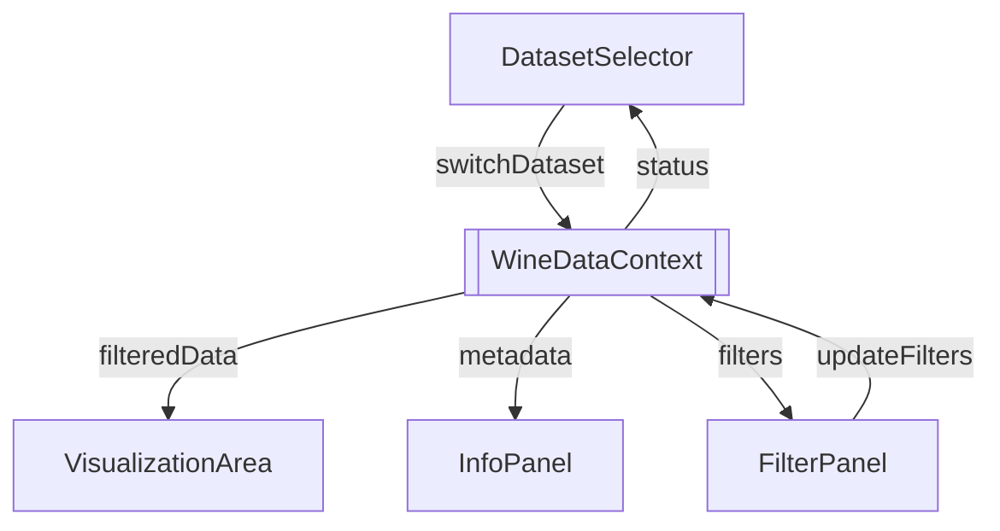

# Components

This section documents the React components that power the Wine Explorer experience. Each component is backed by `WineDataContext`, which exposes dataset state, filters, and error metadata. Use these notes when extending, testing, or integrating new UI elements.

## DatasetSelector

**Responsibility:** Toggle between the red and white wine datasets while surfacing loading progress, retry affordances, and screen-reader announcements.

### Props

- `className?: string` — optional utility class for layout containers.

### Consumed Context

- `currentDataset`, `switchDataset`
- `loading`, `loadStatus`, `error`, `retryLoad`, `lastLoadedAt`
- `wineData` (for total counts)

### Behaviour

- Uses the `useDelayedVisibility` hook to keep spinners visible for a minimum duration and avoid flicker.
- Announces status changes through the Accessibility context (`aria-live`).
- Focuses the error alert when a load failure occurs to immediately inform keyboard users.

### Usage Example

```tsx
<DatasetSelector className="sidebar-section" />
```

## FilterPanel

**Responsibility:** Control the numeric ranges that filter the active dataset and keep the URL in sync for deep-linking.

### Props

- `className?: string`

### Consumed Context

- `filters`, `updateFilters`, `clearFilters`
- `featureRanges`, `isFiltering`, `loading`

### Behaviour

- Range sliders clamp values to `featureRanges` to avoid invalid ranges.
- `updateFilters` dispatches partial updates; debounced state is handled inside the context provider.
- `clearFilters` resets sliders to the dataset-derived ranges.
- Fine-grained ARIA labels describe the active filter values to assistive technology.

### Usage Example

```tsx
<FilterPanel className="sidebar-section" />
```

## VisualizationArea

**Responsibility:** Render histograms and scatter plots based on the currently filtered dataset, and expose controls for choosing which features to plot.

### Props

- `className?: string`

### Consumed Context

- `filteredData`, `isFiltering`, `featureRanges`

### Behaviour

- Dynamically derives available features from the first data row and excludes nominal fields (e.g., `quality`).
- Displays a loading shimmer while filters are recomputed to maintain perceived responsiveness.
- Switches between Plotly histogram and scatter plot traces while preserving selected features across toggles.

### Usage Example

```tsx
<VisualizationArea className="content" />
```

## InfoPanel

**Responsibility:** Present dataset metadata, filtered versus total record counts, and DOI/citation details.

### Props

- `className?: string`

### Consumed Context

- `currentDataset`, `wineData`, `filteredData`, `filters`, `loadStatus`, `lastLoadedAt`

### Behaviour

- Formats metadata into definition lists for semantic clarity.
- Surfaces contextual alerts (e.g., empty filtered results) with recovery advice.
- Encourages attribution by linking to the UCI dataset DOI.

### Usage Example

```tsx
<InfoPanel className="content" />
```

## Component Interactions



Each component should be wrapped by `WineDataProvider` to guarantee access to the shared context values. When rendering components outside the default layout (e.g., in tests), import `WineDataProvider` or mock the context explicitly.
