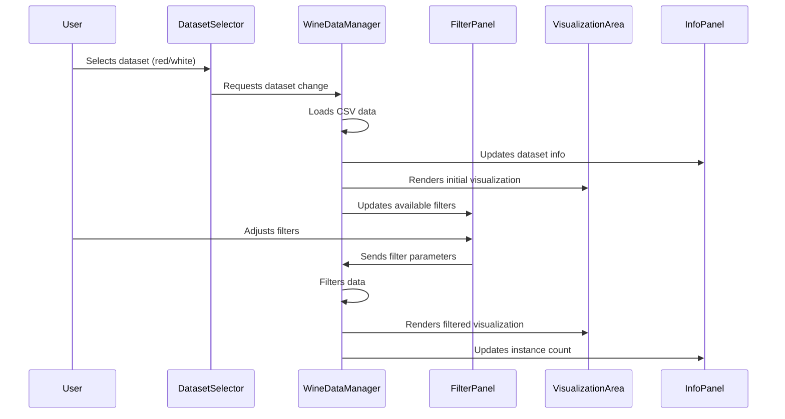

# Core Workflows

```mermaid
sequenceDiagram
    participant U as User
    participant DS as DatasetSelector
    participant WD as WineDataManager
    participant FP as FilterPanel
    participant VA as VisualizationArea
    participant IP as InfoPanel

    U->>DS: Selects dataset (red/white)
    DS->>WD: Requests dataset change
    WD->>WD: Loads CSV data
    WD->>IP: Updates dataset info
    WD->>VA: Renders initial visualization
    WD->>FP: Updates available filters

    U->>FP: Adjusts filters
    FP->>WD: Sends filter parameters
    WD->>WD: Filters data
    WD->>VA: Renders filtered visualization
    WD->>IP: Updates instance count
```
