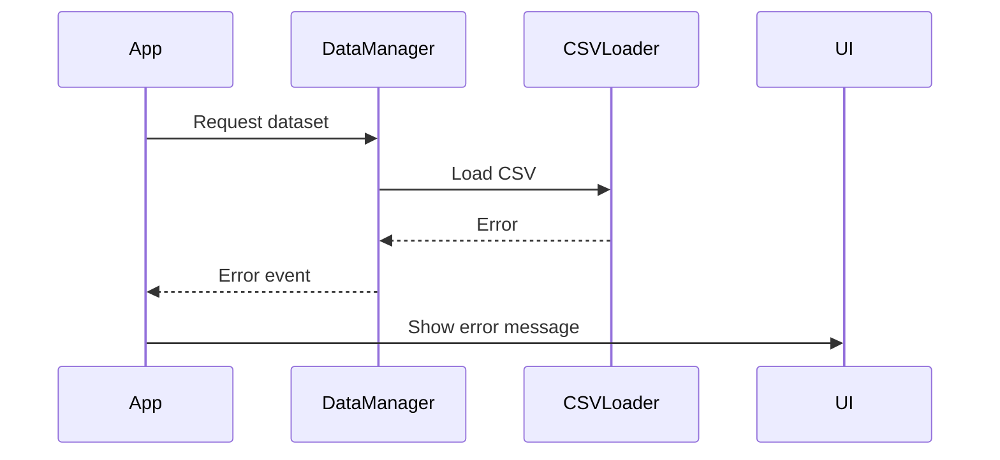

# Error Handling Strategy

## Error Flow



## Error Response Format

```typescript
interface AppError {
  error: {
    code: string;
    message: string;
    details?: Record<string, any>;
    timestamp: string;
    requestId: string;
  };
}
```

## Frontend Error Handling

```javascript
class ErrorHandler {
  static handle(error, context = '') {
    console.error(`[${context}] Error:`, error);
    // Display user-friendly error message
    // Log error for debugging
  }
}
```

## Backend Error Handling

Not applicable for this client-side only application.
