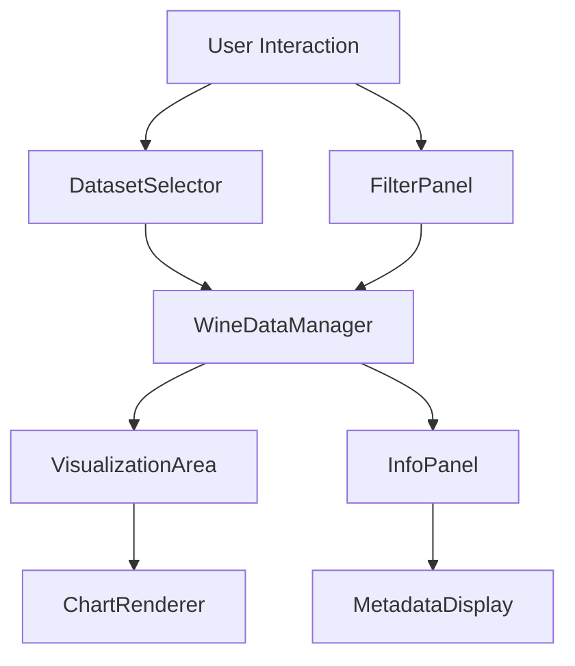

# Components

## DatasetSelector

**Responsibility:** Allows users to switch between red and white wine datasets

**Key Interfaces:**
- onDatasetChange(dataset: 'red' | 'white'): void

**Dependencies:** None

**Technology Stack:** Strudel Kit Toggle Component, Vanilla JS Event Handling

## FilterPanel

**Responsibility:** Provides range sliders for filtering physicochemical features

**Key Interfaces:**
- onFilterChange(filters: WineFilter[]): void
- onClearFilters(): void

**Dependencies:** DatasetSelector (for current dataset)

**Technology Stack:** Strudel Kit Slider Components, Vanilla JS Event Handling

## VisualizationArea

**Responsibility:** Renders histograms and scatterplots based on selected data

**Key Interfaces:**
- renderHistogram(data: WineDataPoint[], feature: string): void
- renderScatterplot(data: WineDataPoint[], xFeature: string, yFeature: string): void

**Dependencies:** FilterPanel (for filtered data)

**Technology Stack:** Canvas API or SVG for rendering, Vanilla JS for data processing

## InfoPanel

**Responsibility:** Displays dataset metadata and citation information

**Key Interfaces:**
- updateDatasetInfo(info: DatasetInfo): void
- updateInstanceCount(count: number, filteredCount?: number): void

**Dependencies:** DatasetSelector (for current dataset)

**Technology Stack:** Strudel Kit Card Component, Vanilla JS DOM Manipulation

## Component Diagrams

