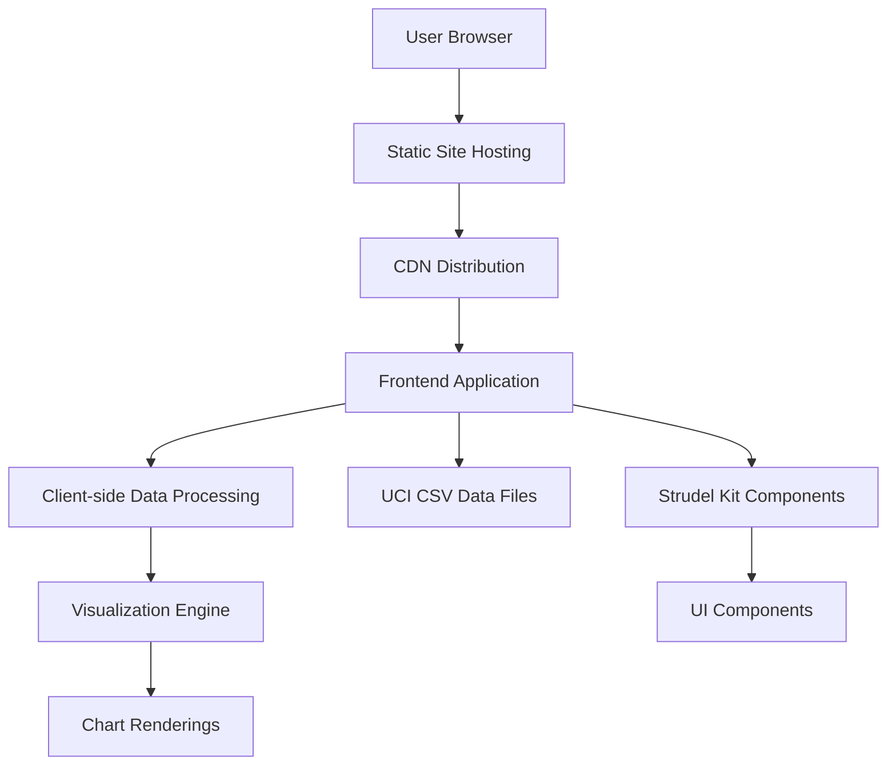

# High Level Architecture

## Technical Summary

The Wine Explorer is a client-side only application designed to demonstrate the Strudel kit's capabilities for scientific data exploration. The architecture follows a modern Jamstack approach with static site generation and client-side data processing. The frontend is built with vanilla JavaScript, HTML, and CSS, leveraging Strudel kit components for UI elements and data visualization. Data is loaded directly from UCI JOSN files and processed client-side. The application is designed to be responsive and accessible, with a focus on performance optimization for datasets under 10MB. This architecture achieves the PRD goals by providing a simple, fast, and demonstrable prototype within a one-month timeline.

## Platform and Infrastructure Choice

**Platform:** Static Site Hosting (GitHub Pages)
**Key Services:** Static file hosting, CDN delivery
**Deployment Host and Regions:** Global CDN with edge locations

Rationale: For a client-side only prototype focused on demonstrating Strudel kit capabilities, a static site hosting platform is the most appropriate choice. It offers:
- Fast, reliable global delivery through CDN
- No backend infrastructure costs
- Simple deployment process
- Excellent performance for static assets
- No server-side complexity needed for this prototype

## Repository Structure

**Structure:** Monorepo with frontend-only application
**Monorepo Tool:** NPM Workspaces (built-in with Node.js)
**Package Organization:**
- `/src` - Main application source code
- `/public` - Static assets (CSV files, images)
- `/docs` - Documentation files
- `/tests` - Test files

## High Level Architecture Diagram

## Architectural Patterns

- **Jamstack Architecture:** Static site with client-side data processing - _Rationale:_ Optimal performance and simplicity for a prototype with no backend requirements
- **Component-Based UI:** Reusable UI components following Strudel kit patterns - _Rationale:_ Maintainability and consistency with Strudel kit demonstration goals
- **Client-Side Data Processing:** Process CSV data in browser - _Rationale:_ Aligns with PRD requirement for client-side implementation and eliminates backend complexity
- **Single Page Application:** All functionality within one HTML page - _Rationale:_ Simplifies development and deployment for prototype scope
