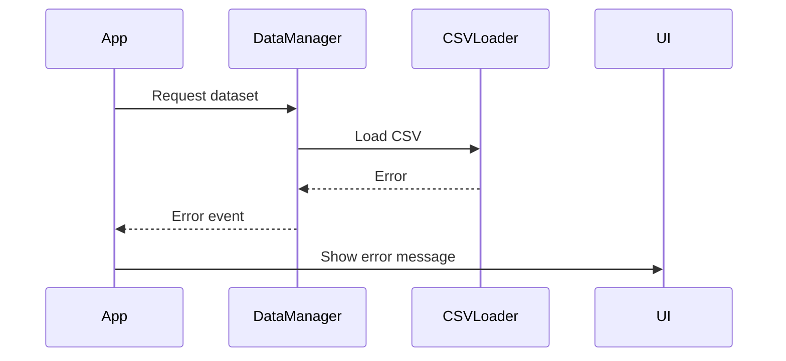

# Story 3.1: Error Handling and Loading States

## Status
Draft

## Story
**As a** Developer,
**I want** to implement comprehensive error handling and loading states,
**so that** users have a smooth experience even when errors occur or data is loading.

## Acceptance Criteria
1. Error handling is implemented for all critical operations
2. Loading states are displayed during data loading and processing
3. User-friendly error messages are shown when errors occur
4. Application gracefully degrades when features are not available
5. Error logging is implemented for debugging purposes

## Tasks / Subtasks
- [ ] Implement error handling for dataset loading
  - [ ] Handle file not found errors
  - [ ] Handle CSV parsing errors
  - [ ] Handle network errors for remote datasets
  - [ ] Display user-friendly error messages
- [ ] Implement loading states for data operations
  - [ ] Show loading indicators during dataset loading
  - [ ] Show loading indicators during filtering
  - [ ] Show loading indicators during visualization rendering
  - [ ] Implement skeleton screens where appropriate
- [ ] Implement retry mechanisms
  - [ ] Add retry buttons for failed operations
  - [ ] Implement automatic retry with exponential backoff
  - [ ] Limit retry attempts to prevent infinite loops
- [ ] Implement graceful degradation
  - [ ] Disable features when dependencies are not available
  - [ ] Show alternative content when visualizations fail
  - [ ] Maintain core functionality when non-critical features fail
- [ ] Implement error logging
  - [ ] Log errors to console for debugging
  - [ ] Implement error reporting for production
  - [ ] Include context information in error logs
- [ ] Add accessibility features
  - [ ] Implement screen reader announcements for errors
  - [ ] Ensure error messages are keyboard accessible
  - [ ] Provide clear focus management during errors
- [ ] Create unit tests
  - [ ] Test error handling scenarios
  - [ ] Test loading state transitions
  - [ ] Test retry mechanisms
  - [ ] Test accessibility features

## Dev Notes
### Implementation Details
Based on the frontend specification and architecture document:

**Error Flow:**


**Loading States:**
Follow the loading state guidelines from the frontend specification:
```
Skeleton Patterns:
┌─────────────────────┐
│ ░░░░░░░░░░░░░░░░░░ │ <- Animated gradient
│ ░░░░ ░░░░░ ░░░░░░░ │    shimmer effect
│ ░░░░░░░░░░░░░░░░░░ │
└─────────────────────┘

Timing:
- Show after 100ms delay
- Minimum display: 300ms
- Fade out: 200ms
```

### Error Handling Patterns
Based on the architecture document, implement these error handling patterns:

**Frontend Error Handling:**
```javascript
class ErrorHandler {
  static handle(error, context = '') {
    console.error(`[${context}] Error:`, error);
    // Display user-friendly error message
    // Log error for debugging
  }
}
```

### Critical Operations to Handle
1. Dataset loading from CSV files
2. CSV parsing and data validation
3. Filtering operations on large datasets
4. Visualization rendering
5. User input validation

### Error Message Guidelines
- Use clear, concise language
- Provide actionable solutions when possible
- Include error codes for debugging
- Maintain consistent styling with the application
- Ensure accessibility with proper ARIA attributes

### Loading State Implementation
Follow the timing guidelines from the frontend specification:
- Show loading indicators after 100ms delay
- Maintain minimum display time of 300ms
- Use 200ms fade out transitions
- Implement skeleton screens for complex components

### Accessibility Requirements
- Follow keyboard navigation map from frontend specification
- Implement screen reader announcements for errors and loading states
- Ensure proper ARIA attributes for error messages
- Maintain focus during error and loading states

### Testing Standards
- Unit tests should be placed in `/tests/unit/utils/` directory
- Test error handling with various error scenarios
- Test loading state transitions
- Test retry mechanisms
- Test accessibility features
- Integration tests for error handling across components

## Change Log

| Date | Version | Description | Author |
|------|---------|-------------|--------|
| 2025-09-08 | 1.0 | Initial story creation | Sarah (Product Owner) |

## Dev Agent Record

### Agent Model Used

### Debug Log References

### Completion Notes List

### File List

## QA Results