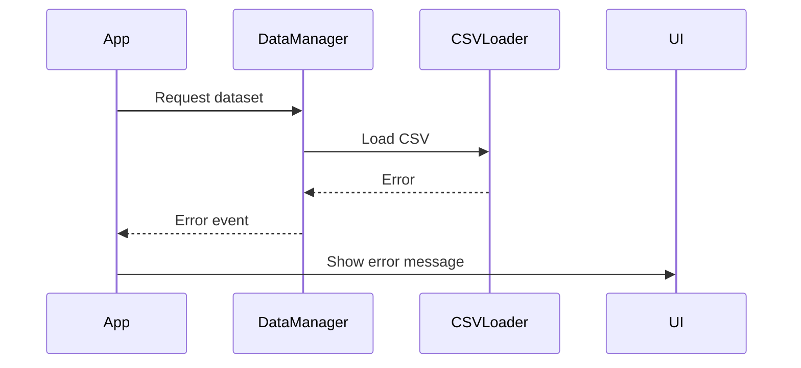

# Story 3.1: Error Handling and Loading States

## Status

Complete

## Story

**As a** Developer,
**I want** to implement comprehensive error handling and loading states,
**so that** users have a smooth experience even when errors occur or data is loading.

## Acceptance Criteria

1. Error handling is implemented for all critical operations
2. Loading states are displayed during data loading and processing
3. User-friendly error messages are shown when errors occur
4. Application gracefully degrades when features are not available
5. Error logging is implemented for debugging purposes

## Tasks / Subtasks

- [x] Implement error handling for dataset loading
  - [x] Normalize loader failures into structured `DatasetLoadError` objects
  - [x] Detect CSV parsing anomalies and halt with descriptive messaging
  - [x] Surface network/file errors with actionable guidance for users
  - [x] Present friendly error banners across dependent panels
- [x] Implement loading states for data operations
  - [x] Introduce delayed skeletons for dataset fetches and visualization shells
  - [x] Preserve visual overlays during filter recalculations
  - [x] Gate visualization rendering with fade transitions while streaming data
  - [x] Align indicator timing with UX spec (100 ms delay / 300 ms minimum)
- [x] Implement retry mechanisms
  - [x] Provide manual retry controls on dataset, filter, and visualization surfaces
  - [x] Add automatic retry with exponential backoff (3 attempts, capped delay)
  - [x] Guard against runaway retries with capped attempts and retryable flag
- [x] Implement graceful degradation
  - [x] Disable filter and visualization controls when data is unavailable
  - [x] Swap in alternative copy when charts cannot render
  - [x] Keep dataset metadata accessible even when ancillary features fail
- [x] Implement error logging
  - [x] Centralize error logging with scoped metadata and dataset context
  - [x] Dispatch custom browser events for future production reporting hooks
  - [x] Include retryable hints and error codes in logged payloads
- [x] Add accessibility features
  - [x] Announce loading/error states via polite live regions
  - [x] Focus error banners automatically for keyboard and AT scenarios
  - [x] Ensure retry affordances and alerts remain keyboard reachable
- [x] Create unit tests
  - [x] Simulate dataset load successes/failures and retry flows
  - [x] Validate skeleton timing and overlay transitions
  - [x] Cover retry buttons across components
  - [x] Assert accessibility affordances in error/loading states

## Dev Notes

### Implementation Details

Based on the frontend specification and architecture document:

**Error Flow:**



**Loading States:**
Follow the loading state guidelines from the frontend specification:

```
Skeleton Patterns:
┌─────────────────────┐
│ ░░░░░░░░░░░░░░░░░░ │ <- Animated gradient
│ ░░░░ ░░░░░ ░░░░░░░ │    shimmer effect
│ ░░░░░░░░░░░░░░░░░░ │
└─────────────────────┘

Timing:
- Show after 100ms delay
- Minimum display: 300ms
- Fade out: 200ms
```

### Error Handling Patterns

Based on the architecture document, implement these error handling patterns:

**Frontend Error Handling:**

```javascript
class ErrorHandler {
  static handle(error, context = '') {
    console.error(`[${context}] Error:`, error);
    // Display user-friendly error message
    // Log error for debugging
  }
}
```

### Critical Operations to Handle

1. Dataset loading from CSV files
2. CSV parsing and data validation
3. Filtering operations on large datasets
4. Visualization rendering
5. User input validation

### Error Message Guidelines

- Use clear, concise language
- Provide actionable solutions when possible
- Include error codes for debugging
- Maintain consistent styling with the application
- Ensure accessibility with proper ARIA attributes

### Loading State Implementation

Follow the timing guidelines from the frontend specification:

- Show loading indicators after 100ms delay
- Maintain minimum display time of 300ms
- Use 200ms fade out transitions
- Implement skeleton screens for complex components

### Accessibility Requirements

- Follow keyboard navigation map from frontend specification
- Implement screen reader announcements for errors and loading states
- Ensure proper ARIA attributes for error messages
- Maintain focus during error and loading states

### Testing Standards

- Unit tests should be placed in `/tests/unit/utils/` directory
- Test error handling with various error scenarios
- Test loading state transitions
- Test retry mechanisms
- Test accessibility features
- Integration tests for error handling across components

## Change Log

| Date       | Version | Description                                                | Author                |
| ---------- | ------- | ---------------------------------------------------------- | --------------------- |
| 2025-09-08 | 1.0     | Initial story creation                                     | Sarah (Product Owner) |
| 2025-09-23 | 1.1     | Error handling, retries, and loading skeletons implemented | Alex (Dev Agent)      |

## Dev Agent Record

### Agent Model Used

OpenAI GPT-5 (Codex CLI)

### Debug Log References

- Unit tests: `npm test`

### Completion Notes List

- Added centralized dataset error normalization, logging, and retry orchestration with exponential backoff
- Introduced consistent skeletons, overlays, and fallback messaging across filters, info, and visualization panels
- Enhanced accessibility with live-region announcements, focus management, and keyboard-safe error commands
- Expanded unit coverage for dataset retries, loading indicators, and component-level error handling (`tests/unit/context/WineDataContext.test.tsx`, `tests/unit/components/*`)

### File List

- `src/context/WineDataContext.tsx`
- `src/utils/WineDataManager.ts`
- `src/utils/errors.ts`
- `src/utils/errorLogger.ts`
- `src/hooks/useDelayedVisibility.ts`
- `src/components/DatasetSelector.tsx`
- `src/components/FilterPanel.tsx`
- `src/components/InfoPanel.tsx`
- `src/components/visualizations/VisualizationArea.tsx`
- `tests/unit/components/*.test.tsx`
- `tests/unit/context/WineDataContext.test.tsx`

## QA Results

- Automated unit suite: `npm test`
- Manual verification pending for production telemetry wiring
